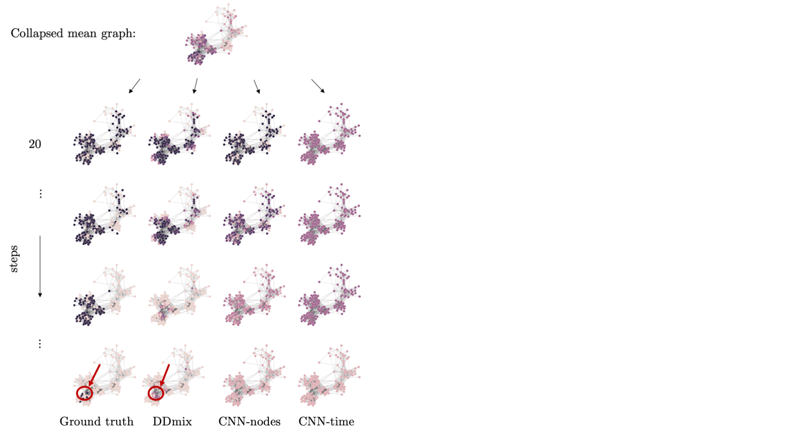

# Deep_demixing
Official repository of the paper 'Deep Demixing: Reconstructing the evolution of epidemics using graph neural networks'


## 0. Prerequisites

- [anaconda](https://docs.anaconda.com/anaconda/install/) (ver=4.8.3)
- python (3.7)
- networkx (2.5)
- [pytorch](https://pytorch.org/get-started/locally/) (1.6.0)
- [pytorch_geometric ](https://pytorch-geometric.readthedocs.io/en/latest/notes/installation.html)(1.6.1)

To make it less tedious for you, we provide a conda env file `./environment.yml`. With anaconda installed, direct to the project root dir and simply run the following lines in your terminal should set everything.

```
$ git clone https://github.com/gojkoc54/Deep_demixing.git
$ cd Deep_demixing
$ conda env create -f environment.yml
$ source activate torch
```

## 1. Getting Started

The organization of data and code in this repo is as follows,

```
Deep_demixing/
        |-- datasets/
        |   |-- exp_1/
        |   |   |-- 5_steps/
        |   |   |   |-- RG_100nodes_20steps_1000sims.obj
        |   |   |   `-- RG_100nodes_20steps_5000sims.obj
        |   |   |-- 10_steps/
        |   |   |-- 15_steps/
        |   |   `-- 20_steps/
        |   |-- exp_2/
        |   `-- ...
        |-- scripts/
        |   |-- exp0-minimal.py
        |   |-- exp1-num_steps.py
        |   `-- ...
        |-- models.py
        |-- trainer.py
        `-- utils.py
```


### 1) Make Sure Basic Training Works
To test a minimal example, run in the commandline,
```
(torch)$ python scripts/exp0-minimal.py
```
(After resolving any extra package requirements,) this will use the toy dataset that we provide you in `./datasets/` and train our DDmix model (we call it CVAE_UNET here) and 3 baseline models (MLP, CNN_time, and CNN_nodes) from scratch. As the training starts, a new folder named `./models/` should be created. Checkpoint files and the final models will be saved under this directory. You can monitor the training with [tensorboard](https://pytorch.org/docs/stable/tensorboard.html) (tb). Basically, you run
```
(torch)$ tensorboard --logdir=MODEL_LOGS_DIR --port=PORT_NUM --bind_all
```
in which `MODEL_LOGS_DIR` is the directory that contains your training logs (e.g. `./models/exp_0/`); the default `PORT_NUM`=6006; the `--bind_all` flag can be dropped if you are on your local machine.

Then in your browser, go to `localhost:PORT_NUM` (if local) or `REMOTE_IP_ADDR:PORT_NUM` (if remote) will take you to the tb dashboard. After the training finishes, the program will automatically stop. In this minimal working example, max epoch is 10 without auto stop for simplicity.

As you may have already found out, the entry point is in `./scripts/*.py`. You can modify configurations and hyperparameters (e.g. number of epochs, minibatch size, frequency of saving checkpoint models, learning rate, regularization coefficient, whether to use gpu and whether to do parallel training, ... etc.) in these files to train models in your favorite flavor.


### 2) Have More Fun
So far so good? Now it's time to dig into the code and see what exciting things you can try out with our framework!

First of all, the data -- Our experiments rely on synthetic SIRS epidemics on (synthetic or real-world) graphs. This brief tutorial will start with a guidance for you to generate your own dataset. Next, we will show where and how our models are declared. We will also walk you through the `Trainer` class, a wrapper that we designed to manage the train, evaluate and tune models in a systematic manner. Finally, we will show some basic ways to visualize the results and compare performance.

#### i. Data Generation

> Please note: this section is under construction. Before we clear up and put together the code and docs of data generation, you can use the provided dataset at `./datasets/*`.

The scripts `???.py` and `???.py` generate data for this project.

##### a. Random Geometric (RG) Graphs
TBD.

##### b. Primary School Temporal Contact Graphs
TBD.

##### c. SIRS Epidemic Model
TBD.

##### d. Dataset and Data Loaders
TBD.

#### ii. Model and Trainer Declaration

All the candidate models are declared in `./models.py`. They inherit from the `torch.nn.Module` class, and you can find its documentation [here](https://pytorch.org/docs/stable/generated/torch.nn.Module.html) and a detailed tutorial to customize it [here](https://pytorch.org/tutorials/beginner/pytorch_with_examples.html#pytorch-custom-nn-modules). Depending on whether the model is graph-based, you may choose from the 2 types of trainers defined in `./trainer.py`, namely the `CVAE_Pr_Trainer` and the `Benchmark_Trainer`. Here we introduce the usage of `CVAE_Pr_Trainer` in detail; the other one is very much similar or even simpler.

----
- CLASS trainer.GCVAE_Trainer(model, check_path, optimizer, resume=True, **kwargs)</span> [[SOURCE]](./trainer.py#L336)
  - A wrapper for PyTorch models.
  - Parameters:
    - **model** (*torch.nn.Module*) – the PyTorch model to train/validate/tune.
    - **check_path** (*string*) - the path to save/load the model.
    - **optimizer** (*torch.optim.Optimizer*) - the PyTorch optimizer to use for training the model.
    - **resume** (*bool*) - if True, load model parameters from a previous checkpoint if available. Otherwise, or if no checkpoint is found, train the model from scratch.
    - **kwargs** (*dict*) - a dict containing optional values of training options.
        - **display_step** (*int*, *optional*) - how many steps to display or log training stats.
        - **gradient_clipping** (*float*, *optional*) - parameter for gradient clipping.
        - **decay_step** ( [*int*, *float*], *optional*) - number of steps ( decay_step[0] ) before the learning rate decays by a factor ( decay_step[1] ).
        - **l2** (*float*, *optional*) - if set, this will be the coefficient for l2 regularization.
        - **max_steps** (*int*, *optional*) - if set, this will be the number of time-steps that we consider when training the model. For example, if we pass in input data `y` of shape (BN, T) and max_steps=T_m ( <T ), then you can think of it as equivalent to slicing `y` into `y[:,:T_m]`.
        - **auto_stop** (*int*, *optional*) - during training, if the validation loss stops dropping for no more than this number of epochs, the training has to hang in there. Once exceeding this number, the trainer will automatically terminate.
  - Methods:
    - **train** (*epoch: int, criterion: dict, loader: DataLoader*) $\rightarrow$ None
      - Parameters:
        - **epoch** (*int*) - current epoch number.
        - **criterion** (*dict*) - a dict of loss functions to use. Should be in the format of `{'kld': ..., 'bce': ..., 'rule': ...}`. Among the fixed keys, `'kld'` is the KL-divergence loss between posterior and prior nets; `'bce'` is the binary cross entropy loss of the reconstructed graph signals; `'rule'` is the spreading rule based regularizer that's specific to our definition. (Our rule basically says if your neighbors are not infected in day t-1, then you cannot get infected in day t.)
        - **loader** (*torch_geometric.data.DataLoader/DataListLoader*) - training dataloader.

    - **predict** (*epoch: int, criterion: dict = None, loader:DataLoader = None, save: bool = False*) $\rightarrow$ y_true, y_hat, A_coo
      - Parameters:
        - **epoch** (*int*) - current epoch number.
        - **criterion** (*dict*, *optional*) - same as in `.train()`.
        - **loader** (*torch_geometric.data.DataLoader/DataListLoader*) - validation or test dataloader.
        - **save** (*bool*, *optional*) - if True, save the model if the predicted loss turns out to be the current smallest.
      - Returns:
        - **y_pr** (*numpy.array*) - predicted probabilities of reconstructed graph signals.
        - **y_gt** (*numpy.array*) - ground truth graph signals.
        - **A_eidx** (*numpy.array*) - the associated graph adjacency in the form of edge index.

        - **predict** (*epoch: int, criterion: dict = None, loader:DataLoader = None, save: bool = False*) $\rightarrow$ y_true, y_hat, A_coo
          - Parameters:
            - **epoch** (*int*) - current epoch number.
            - **criterion** (*dict*, *optional*) - same as in `.train()`.
            - **loader** (*torch_geometric.data.DataLoader/DataListLoader*) - validation or test dataloader.
            - **save** (*bool*, *optional*) - if True, save the model if the predicted loss turns out to be the current smallest.
          - Returns:
            - **y_pr** (*numpy.array*) - predicted probabilities of reconstructed graph signals.
            - **y_gt** (*numpy.array*) - ground truth graph signals.
            - **A_eidx** (*numpy.array*) - the associated graph adjacency in the form of edge index.
----

For more details and extensive usage, please refer to the training scripts `./scripts/*.py`.

#### iii. Analysis of Results
We analyze and compare results yielded by candidate model both quantitatively and qualitatively. Quantitatively, we adopt the mean square error (MSE) to evaluate the node-level binary (infected / not infected) reconstruction performance. Additionally, we examine the top-k accuracy of sourcing the initial infected point performed by these models. Qualitatively, here we display the reconstructed graphs over time to show that our proposed model indeed does well finding the patient(s) "zero".

**Table 1**: MSE of predictions on unseen graphs with different graphdensity for two different lengths of the epidemics.
| Graph density  | Baseline       | Denser        | Sparser        |
|----------------|:--------------:|:-------------:|:--------------:|
| **Time steps (T)** | **10** \| **20** | **10** \| **20**| **10** \| **20**|
| MLP            | .217  \|  .233 | .289  \| .268 | .254   \| .254 |
| CNN-nodes      | .106  \|  .188 | .270  \| .239 | .177   \| .232 |
| CNN-time       | .143  \|  .194 | .267  \| .240 | .168   \| .226 |
| DDmix    |**.101** \| **.177** | **.160** \| **.197** | **.075** \| **.216** |


**Figure 1**. DDmix is able to trace the cluster of initially infected nodes to its accurate source, whereas the non-graph-aware methods cannot. Unlike DDmix's reconstruction where one can clearly observe local and global spreading paths, their node probabilities just universally fade away as going back in time.

## References
- http://www.sociopatterns.org/datasets/primary-school-temporal-network-data/
